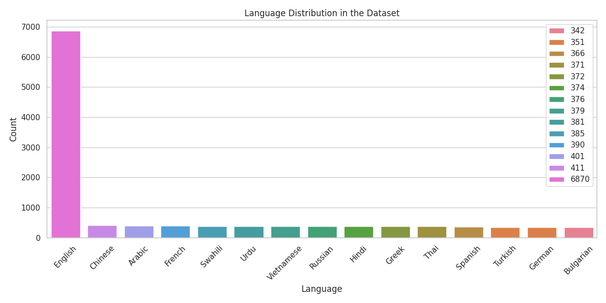
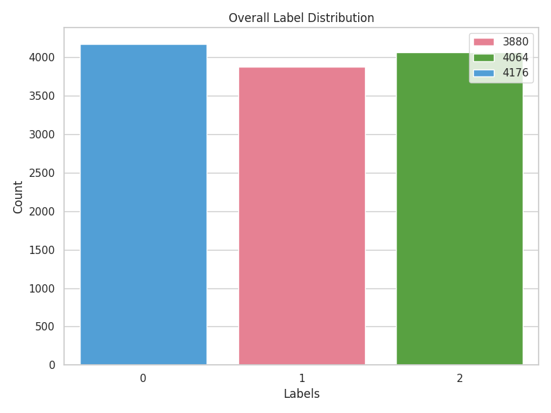
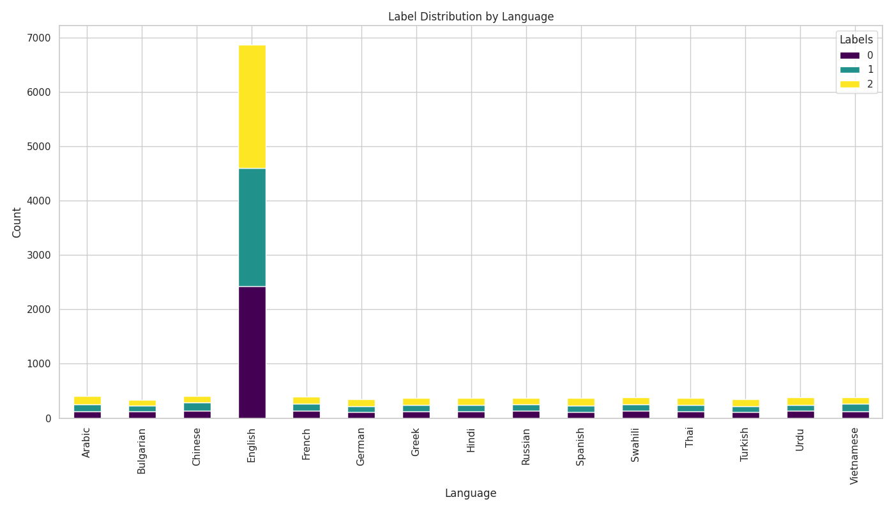
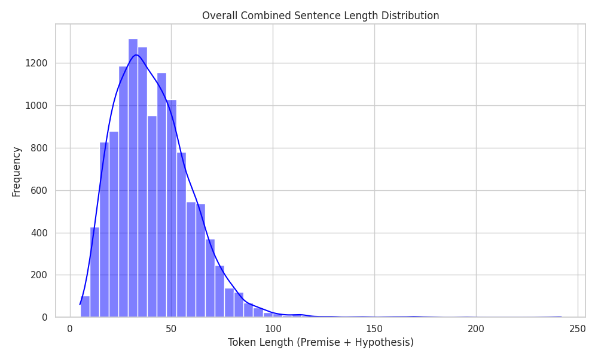
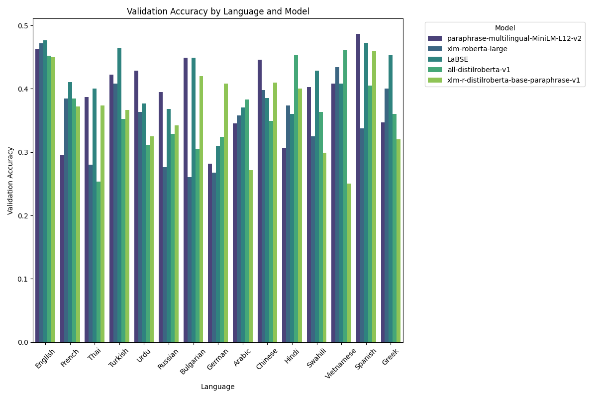
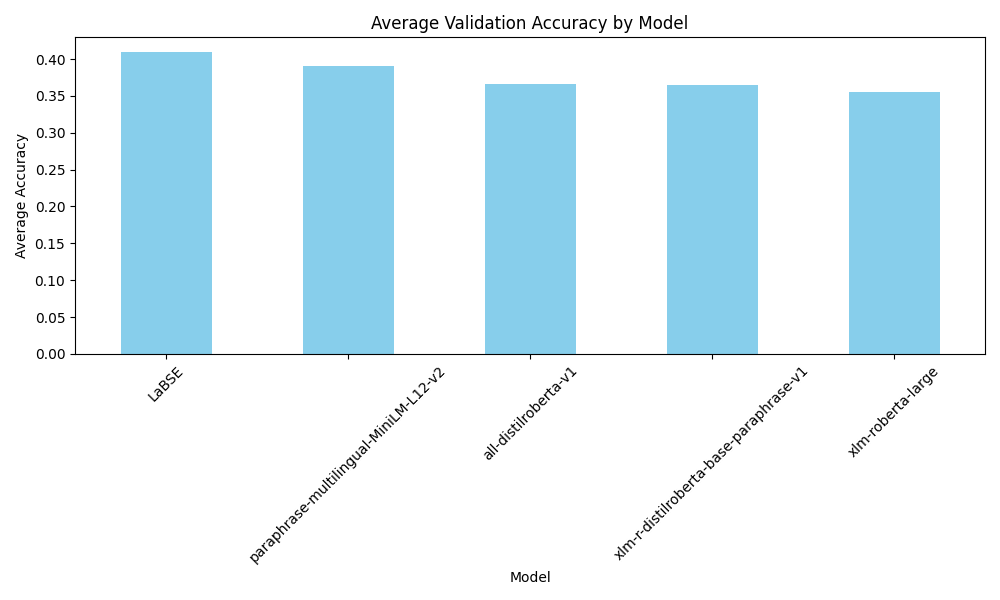
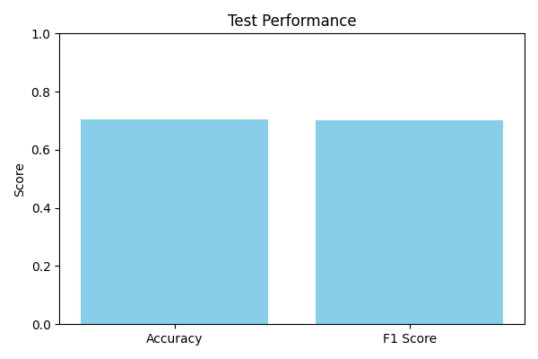
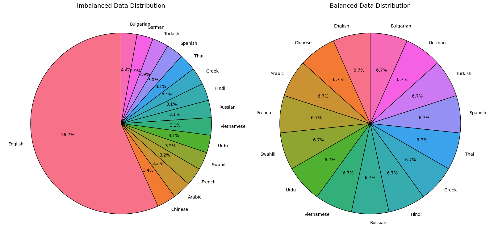
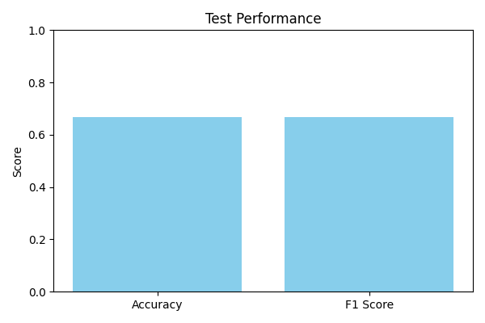

# Multilingual NLI Kaggle Project: Contradictory, My Dear Watson

## **Overview**
This project is inspired by the Kaggle competition **"Contradictory, My Dear Watson"** (Amy Jang, Ana Sofia Uzsoy, and Phil Culliton, 2020). The goal is to develop a Natural Language Inference (NLI) model capable of determining the relationships between sentence pairs in multiple languages. [Link to Competition](https://kaggle.com/competitions/contradictory-my-dear-watson)

> “...when you have eliminated the impossible, whatever remains, however improbable, must be the truth.”  
> — Sir Arthur Conan Doyle  

### **Background**
Natural Language Processing (NLP) has advanced rapidly in recent years, addressing complex problems like question answering, sentence generation, and fact-checking. This competition explores whether machines can determine relationships between sentence pairs, a task crucial for analyzing fake news, fact-checking, and understanding textual relationships.

Given two sentences (a **premise** and a **hypothesis**), there are three possible relationships:
- **Entailment**: One sentence logically follows from the other.
- **Contradiction**: One sentence negates the other.
- **Neutral**: Neither entails nor contradicts the other.

### **The Challenge**
Participants are tasked with developing a model that assigns one of the following labels to a sentence pair:
- **0**: Entailment
- **1**: Neutral
- **2**: Contradiction

The dataset includes sentence pairs in 15 different languages, providing a unique multilingual challenge for NLP models.

### **Evaluation**
- **Metric**: The submissions are evaluated based on accuracy, i.e., the percentage of relationships correctly predicted in the test set.
- **Submission File**: A CSV file containing two columns:
  1. **id**: The unique identifier for each test sample.
  2. **prediction**: The predicted label (0, 1, or 2).

A valid submission must contain exactly 5195 entries and follow the prescribed format.

### **Why This Problem Matters**
Success in this competition has real-world implications, such as:
- Enhancing the accuracy of multilingual fact-checking systems.
- Identifying contradictory or supporting claims in large text corpora.
- Pushing the boundaries of multilingual NLP using modern techniques like embeddings and transformers.

---

## **Getting Started**
To get started, Kaggle provides a starter notebook that uses **TPUs** and models like **BERT** for training and inference. TPUs offer high computational power and are ideal for deep learning tasks, including NLP.

You can also refer to Kaggle’s excellent resources, including:
- [KerasNLP Tutorial](https://keras.io/examples/nlp/nli_with_keras_nlp/)
- [Ana Sofia Uzsoy’s Beginner Notebook](https://www.kaggle.com/code/anasofiauzsoy/contradictory-my-dear-watson-starter-tpu)

This project leverages similar methodologies while exploring advanced techniques like **data balancing**, **augmentation**, and **fine-tuning**.

---

## **Citation**
Amy Jang, Ana Sofia Uzsoy, and Phil Culliton. [Contradictory, My Dear Watson](https://kaggle.com/competitions/contradictory-my-dear-watson), 2020.

## Step 1: Data Exploration

### **Notebook:** [step1_data_exploration.ipynb](scripts/step1_data_exploration.ipynb)
In this step, we explore the dataset to understand its characteristics, including language distribution, label distribution, and token length analysis. These insights inform the preprocessing and modeling strategies.

### **Key Insights:**

1. **Language Distribution**
   The dataset contains sentence pairs across 15 languages, with a significant imbalance in the number of data points per language.
   

2. **Label Distribution**
   The labels—**entailment (0)**, **neutral (1)**, and **contradiction (2)**—are distributed unevenly across the dataset.
   

3. **Label Distribution by Language**
   Combining language and label distribution provides a detailed view of how labels vary across different languages. This highlights potential biases in the dataset.
   

4. **Token Length Analysis**
   Analyzing the token lengths of premises and hypotheses ensures efficient tokenization. This helps determine the appropriate `max_length` parameter during preprocessing.
   

---

These visualizations emphasize the dataset's imbalance in both language and label distributions, motivating the need for data balancing and augmentation in subsequent steps.

## Step 2: Evaluating Pre-trained Models on Individual Languages

### **Notebook:** [step2_per_language_model_eval.ipynb](scripts/step2_per_language_model_eval.ipynb)
This step evaluates the performance of frozen pre-trained models on individual languages to understand their baseline performance without fine-tuning.

### **Objective:**
To test and compare the performance of several pre-trained models—**LaBSE**, **XLM-R**, and **MiniLM**—on datasets split by language. This helps assess whether the dataset imbalance affects specific languages disproportionately and identifies the best-performing model for further fine-tuning.

### **Key Insights and Conclusions:**
1. **Consistent Performance Across Languages**:
   The models generally perform equally well across most languages, showing robustness to imbalances in training data.

2. **Best Performance for English and Spanish**:
   The highest validation accuracy was observed for English and Spanish, likely due to their prevalence in the dataset and relative simplicity of grammar compared to some other languages.

3. **Low Performance for French and German**:
   The models showed the lowest performance for French and German, possibly due to the complexity of their grammar and sentence structure.

4. **Data Imbalance Had Limited Impact**:
   Despite English having substantially more datapoints than other languages, the imbalance does not seem to significantly affect the model’s overall performance.

---

### **Key Plots:**

1. **Validation Accuracy by Language and Model**
   This plot shows the validation accuracy for each tested model across all 15 languages. It highlights the performance disparity among languages, with models performing better on high-resource languages like English.
   

2. **Average Accuracy by Model**
   This bar chart highlights the overall average validation accuracy of each model across all languages. It helps identify the best-performing model to proceed with fine-tuning.
   

---

These results indicate that pre-trained models perform reasonably well on high-resource languages like English and Spanish but struggle with complex or low-resource languages. This highlights the importance of fine-tuning to adapt the model to specific tasks and linguistic nuances.

## Step 3: Fine-Tuning on Imbalanced Data

### **Notebook:** [step3_fine_tunning_imbalance_data.ipynb](scripts/step3_fine_tunning_imbalance_data.ipynb)

---

### **Objective:**  
Fine-tune **XLM-RoBERTa-base** on the imbalanced dataset to evaluate its performance on the validation and Kaggle test sets.

---

### **Result:**  

- Achieved a **Kaggle test score of 0.705**.
- The fine-tuned model demonstrates improved performance over pre-trained models but remains biased towards high-resource languages, such as English.

---

### **Visualization:**  

- **Test Performance:**  
  The bar chart below (from `test_performance_imbalance.png`) illustrates the accuracy and F1 score of the fine-tuned model on the validation set.  
  

## Step 4: Fine-Tuning on Individual Languages

### **Notebook:** [step4_fine_tunning_per_language.ipynb](scripts/step4_fine_tunning_per_language.ipynb)

---

### **Objective:**  
Train separate models for **English**, **Spanish**, and **Chinese** to assess the impact of imbalanced data on individual language performance.

---

### **Findings:**  

- **Performance on English:**  
  The model achieved a validation accuracy of approximately **0.71** for English, consistent with the overall dataset performance. This reflects the dominance of English in the training data.

- **Performance on Spanish and Chinese:**  
  Spanish and Chinese, with fewer training samples, achieved validation accuracies of **0.67** and **0.59**, respectively. These results highlight the model's struggle with underrepresented languages.

- **Impact of Imbalanced Data:**  
  The high accuracy on English, coupled with lower accuracies on Spanish and Chinese, confirms that the model's performance on the imbalanced dataset is heavily influenced by English. The dominance of English skews the weighted average of the model's overall accuracy.

- **Implications for Data Balancing:**  
  This analysis supports the hypothesis that **balancing the data could improve the model's overall performance**. By ensuring equal representation of all languages in the training set, the model would generalize better across all languages, not just English.

---

### **Conclusion:**  
The analysis confirms that **imbalanced data hinders performance on underrepresented languages**. Addressing this imbalance through data balancing or augmentation could enhance multilingual generalization and fairness.

## Step 5: Fine-Tuning on Balanced Data

### **Notebook:** [step5_fine_tunning_balanced_data.ipynb](scripts/step5_fine_tunning_balanced_data.ipynb)

---

### **Objective:**  
Balance the dataset by redistributing entries from the overrepresented language (**English**) to underrepresented languages, while keeping the total dataset size constant.

---

### **Results:**  

- **Kaggle Test Score:** 0.6947 (slightly lower than the score of ~0.705 achieved with the imbalanced dataset).  
- **Visualizations:**  
    -   
      *Compares language distributions before and after balancing.*  
    -   
      *Shows the fine-tuned model's performance on the test set.*

---

### **Analysis:**  

1. **Positive Impact of Balancing:**  
   Balancing improved representation for underrepresented languages by increasing their data points to **809 entries each**. This adjustment aimed to enhance the model's fine-tuning for these languages.

2. **Negative Impact on English:**  
   The dataset size for English was significantly reduced from **~6,870 entries to 809**. This reduction likely affected the model's ability to generalize well for English, which comprises a substantial portion of the validation and test sets.

3. **Net Effect:**  
   While balancing improved the performance for underrepresented languages, the substantial reduction of English data outweighed these gains. This led to a slight overall drop in performance.

---

### **Key Insight:**  

**Balancing the dataset improved fairness across languages but reduced the overall performance due to the drastic reduction in English entries.**

---

### **Next Steps:**  

To address this limitation, we explore **balancing with augmentation** in the next step. This involves adding additional data points for underrepresented languages without significantly reducing the entries for English.

